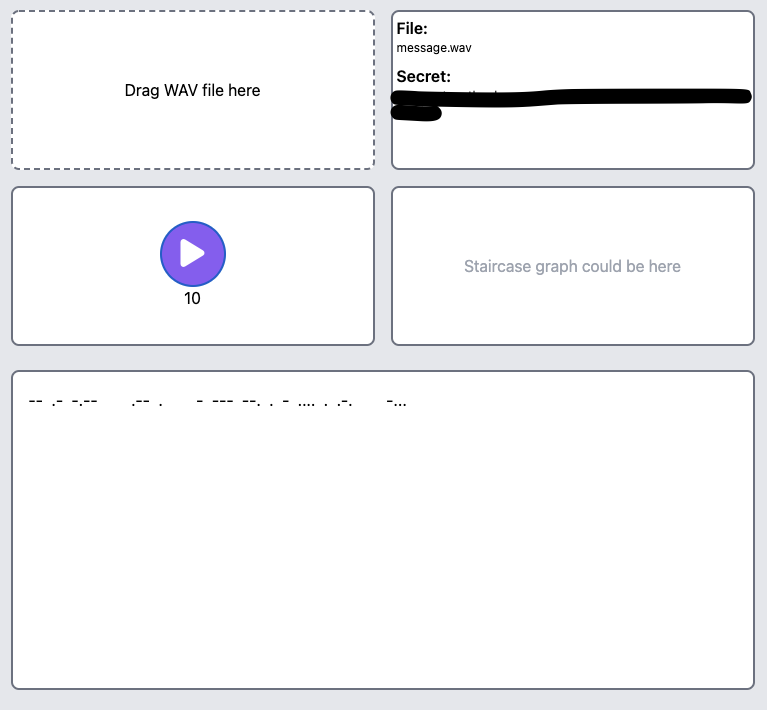
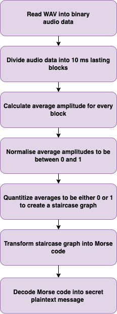

# wav-to-morse-web
Finds Morse code inside of WAV file and prints it.
This is another solution to problem that is also solved in https://github.com/anttiz/wav-to-morse

  <kbd>
    
    
  </kbd>

## Description

This web page takes WAV file as input (file can be dragged and dropped) and tries to find Morse code from inside of it. It outputs the finding as a string to Result box. It is also possible to play the file (ensure you have volume!).

### Built with

- Web components (Lit)
- TypeScript
- Unit testing with Jest
- ESLint static linter

## Getting started

### Prerequisites

This has been mostly tested with MacOS Chrome and Safari.

### Install

Install node modules by running command `npm install`

### Build

Just build TypeScript files into dist folder by command `npm run build`

### Usage

Once build is successful, just open dist/index.html in the browser.
Drag and drop input wav file to top-left box as in above pictures.
### Usage in development

Build and execute by running `npm start`. This will open web server running in http://localhost:3000 . Page is reloaded once changes are done.

### Unit testing

Critical parts of code have been unit tested with Jest. To run the unit tests, run command `npm test`. In VSCode, it is also possible to debug unit tests by using `Jest current file` debug command. To run tests in watch mode, use command `npm run test:watch`.

### ESLint

Lint errors can be checked by running command `npm run lint`.

## Algorithm

Following diagram explains the process how Morse code is decoded from WAV file.

  <kbd>
    
  </kbd>

